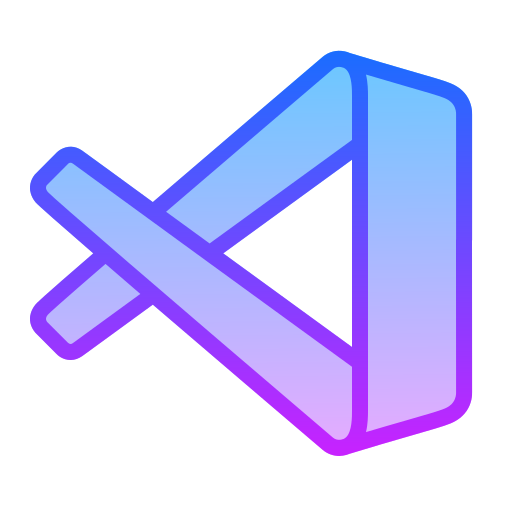
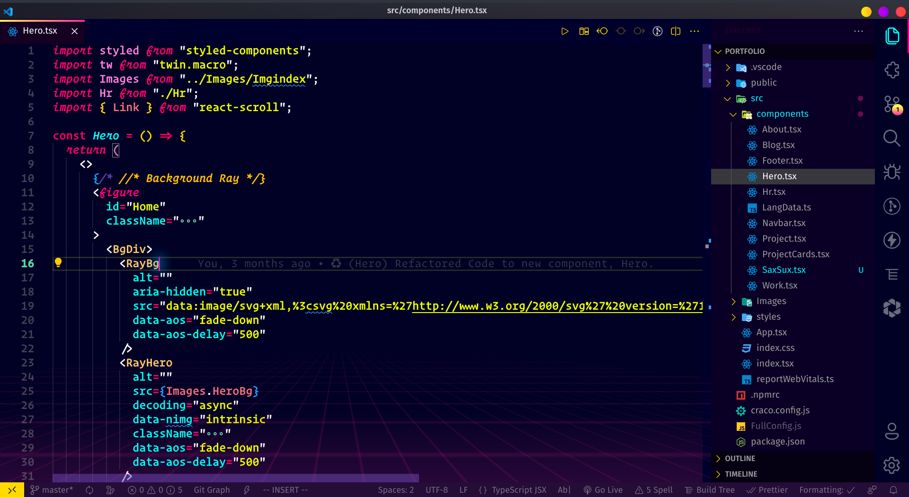
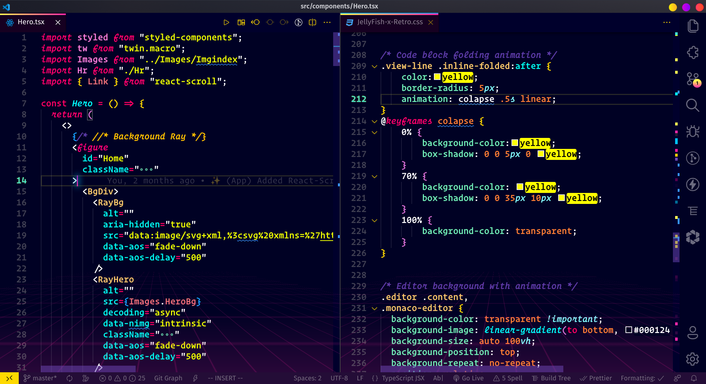
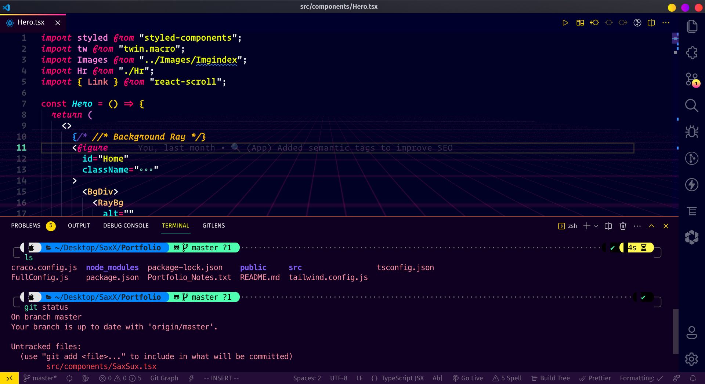

<div align="center">

# JellyFish-x-Retro 🚀



<br>

> _Get ready to fall in Love with the Retro theme ♥️_

<br>

*This is a fork of <a href="https://github.com/pawelborkar/vscode-jellyfish">JellyFish</a> Theme.*


 <i style="font-size: .8em">Appealing colors</i>

<br>


 <i style="font-size: .8em">Cool gradients all over the theme</i>

<br>


 <i style="font-size: .8em">Awesome color combination of terminal</i>

<br>


 <i style="font-size: .8em">Rocking Retro Animations</i>

<br>


<i  style="font-size: .8em">Epic neon glowing tooltips, scale on hover and folding effects</i>

<br>

---

</div>

## Features of this Fork 💫

First of all Thanks a lot to [Pawel Borkar](https://github.com/pawelborkar) for such amazing work !!  
This fork mainly includes Aesthetic retro look with crazy animations.

## Installation 🗃️

Unfortunately, the current installation is a bit complicated.  
The following steps must be performed to install the theme:

1. Install this theme  
2. Install [Custom CSS and JS Loader](https://marketplace.visualstudio.com/items?itemName=be5invis.vscode-custom-css) vscode extension
3. Link the CSS file from this extension in your .vscode/settings.json:
   - To find settings.json: Hit CTRL + SHIFT + P and type "Open Settings (JSON)" and click the matching entry.

```
On Mac it might look something like the snippet below:

{
  "vscode_custom_css.imports": [
    "file:///Users/{your username}/.vscode/extensions/Bhanu1776.vscode-Jellyfish-x-Retro/themes/JellyFish-x-Retro.css"
    ]
}

Windows might resemble:

{
  "vscode_custom_css.imports": [
    "file:///C:/Users/{your username}/.vscode/extensions/Bhanu1776.vscode-Jellyfish-x-Retro/themes/JellyFish-x-Retro.css"
    ]
}
```

4. From the command panel, select `Reload Custom CSS and JS`. You'll need to run this command every time vscode updates!

<br/>

## Font 🔨

The font being used in the screenshot above is [Operator Mono with Ligatures](https://github.com/kiliman/operator-mono-lig).

## Contributing ✨

This is an open source project, and contributions of any kind are welcome and appreciated. Feel free to open bug tickets and make feature requests.

## Contact ☎️

<p align=left>
<a href="https://in.linkedin.com/in/bhanu-sunka-94a24a21a"></a>
<a href="https://www.instagram.com/bhanu_1776/"></a>
<a href="https://mobile.twitter.com/sunkabhanu"></a>
<a href="mailto:sunkabhanu281202@gmail.com"></a>

## Support Me If You Appreciate My Work 🫂

<a href="https://www.buymeacoffee.com/Bhanu1776"></a>

<hr>

© 2022 Bhanu Sunka
This project is licensed under the [**MIT license**](https://github.com/Bhanu1776/vscode-Jellyfish-x-Retro/blob/star/LICENSE).

[](https://forthebadge.com)
